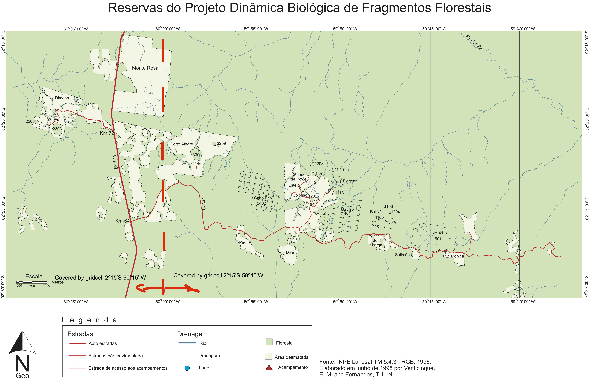

```{r setup, include=FALSE}
knitr::opts_chunk$set(echo = TRUE)
library(tidyverse)
library(skimr)
library(here)
library(conflicted)
library(plotly)
library(lubridate)
library(tsibble)
library(corrr)
conflict_prefer("filter", "dplyr") 
conflict_prefer("lag", "dplyr")
```

*Last compiled: `r Sys.Date()`*

# Purpose
Identify problems in the data.  Figure out what to do with missing values and multi-day accumulated values. Explore consistency of precip data across sites at BDFFP at different levels of aggregation (daily, monthly, yearly). 

# Load Data

```{r data, echo=TRUE}
bdffp <- read_csv(here("data_cleaned", "daily_precip.csv"), col_types = cols(site = col_character()))
skim(bdffp)
```

# Try as a tsibble

Going to try converting to a tsibble and using the tsibble package and other tidyverts packages for some analyses.

```{r}
bdffp_ts <- as_tsibble(bdffp, key = site, index = date)
```

## Visualize Gaps

This method only shows the *implicit* gaps (dates that are just not there in the spreadsheet)

```{r}
bdffp_ts %>% 
  count_gaps(.full = TRUE) %>% 
  ggplot(aes(y = site)) +
  geom_linerange(aes(xmin = .from, xmax = .to)) +
  geom_point(aes(x = .from)) +
  geom_point(aes(x = .to)) +
  labs(x = "Date", y = "Site", title = "Implicit gaps in data")
```

Here's one way to visualize **all** the gaps (includes dates entered into spreadsheet, but with no observations made)

```{r}
bdffp_ts %>% 
  filter(!is.na(precip)) %>% 
  count_gaps(.full = FALSE) %>% 
  ggplot(aes(y = site)) +
  geom_linerange(aes(xmin = .from, xmax = .to)) +
  # geom_point(aes(x = .from)) +
  # geom_point(aes(x = .to)) +
  labs(x = "Date", y = "Site", title = "All gaps in data")
```

But that's sort of useless.  


# Deal with accumulations

Mark possible untagged accumulations as any un-flagged precip value after one or more NAs.

```{r}
bdffp <- bdffp %>% 
  mutate(gaptype = case_when(
    flag == "accumulated" ~ "accumulated",
    !is.na(precip) & is.na(lag(precip)) ~ "untagged",
    !is.na(precip) & !is.na(lag(precip)) ~ "ordinary"
  ))

```

## Compare tagged, untagged, and no gap

How much rain after each type of gap?

```{r}
bdffp %>% 
  group_by(site) %>% 
  filter(!is.na(precip)) %>% 
  mutate(gaptype = fct_relevel(gaptype, "ordinary", "untagged", "accumulated")) %>% 
  ggplot(aes(precip)) +
  geom_histogram(aes(y = after_stat(ncount))) +
  facet_wrap("gaptype", ncol = 1) +
  labs(x = "Precipitation (mm)", y = "Proportion of observations", caption = '"ordinary" = no preceding gap\n "untagged" = preceding gap w/ no note\n "accumulated" = preceding gap w/ note that obs is accumulated precip')
```
I think at least some of the untagged values following gaps are probably accumulations, and some might be zeroes.  Either way, for aggregated data it's probably OK to sum at least for small-ish time gaps that aren't near month borders.

```{r}
bdffp %>% filter(gaptype == "untagged" & !is.na(notes))
bdffp %>% count(gaptype)
bdffp %>% filter(gaptype == "untagged", precip > 0) %>% count()
```
1161 potentially untagged accumulations

## Length of gaps

```{r}
# calculates number of NAs before an observation.  Excludes leading NAs at each site.
gaps <- 
  bdffp %>% 
  group_by(site) %>% 
  # mutate(row = row_number()) %>% #probably not necessary
  mutate(cumna = cumsum(is.na(precip))) %>% 
  filter(!is.na(precip)) %>% 
  mutate(gap_len = cumna - lag(cumna)) %>% 
  mutate(gap_len = na_if(gap_len, 0)) %>% 
  select(-cumna)
bdffp <- full_join(bdffp, gaps)  
```

```{r}
gap_summary <- 
  bdffp %>% 
  group_by(gaptype) %>% 
  summarize(mean_gap = mean(gap_len, na.rm = TRUE),
            median_gap = median(gap_len, na.rm = TRUE),
            max_gap = max(gap_len, na.rm = TRUE)) %>% 
  filter(gaptype %in% c("accumulated", "untagged"))
gap_summary

bdffp %>% filter(gap_len > 30 & flag == "accumulated")
```

Plotting gap length vs precip after gap.  (is this helpful?)

```{r}
bdffp %>% 
  filter(gaptype %in% c("accumulated", "untagged")) %>% 
  filter(gap_len < 300) %>% 
  ggplot(aes(x = gap_len, y = precip, color = gaptype)) +
  geom_point()
```

## Are NA's zeroes?

How are NAs distributed over time?  Are they more common in the dry season?  Then they might actually sometimes be zeroes (uh oh).

```{r}
bdffp %>% 
  mutate(month = month(date, label = TRUE)) %>% 
  group_by(site, month) %>%
  summarize(prop_NA = sum(is.na(precip))/n()) %>% 
  ggplot(aes(x = month, y = prop_NA)) + geom_col() +
  labs(x = "Month", y = "Proportion of missing values") +
  facet_wrap(~site) +
  theme(axis.text.x = element_text(angle = 45, hjust = 1))
ggsave("distribution of NAs.png")
```

NAs are more common the the dry season in at least some sites indicating that some of those NAs are probably actually zeroes.

km41 is the best data

# Compare With Other Data Sources

I'll merge these rain gauge data with the continuous data from the Manaus weather station and the interpolated GPCC data.  Then, one site at a time, I'll investigate concordance among data sources.

## Prep for merging

Since the GPCC data is aggregated monthly, here I'll aggregate monthly as well.  For now, I'll ignore accumulated precip that crosses month borders and just sum everything for the month, removing missing values.  If there are no precip measurments for the month at a site, then it is a true NA for total precip.

### Aggregate BDFFP data 

```{r}
bdffp_ts <- 
  as_tsibble(bdffp, key = site, index = date) %>%
  fill_gaps()

bdffp_mon <- 
  bdffp_ts %>% 
  index_by(yearmonth = yearmonth(date)) %>% 
  group_by(site) %>% 
  summarize(min_tot_precip = sum(precip, na.rm = TRUE),
            percent_complete = sum(!is.na(precip))/n()*100) %>% 
  mutate(min_tot_precip = ifelse(percent_complete == 0, NA, min_tot_precip))
```

### Add Manaus data

```{r}
manaus <- read_csv(here("data_cleaned", "manaus_weather.csv"))
# manaus <- as_tsibble(manaus, index = date)
manaus <- 
  manaus %>% 
  filter(between(date, min(bdffp$date), max(bdffp$date))) %>% 
  as_tsibble(index = date)

manaus_mon <- manaus %>% 
  index_by(yearmonth = yearmonth(date)) %>% 
  summarize(site = "manaus",
            min_tot_precip = sum(precip),
            percent_complete = 100)

bdffp_manaus <- bind_rows(bdffp_mon, manaus_mon)
```

### GPCC data

```{r}
gpcc <- read_csv(here("data_cleaned", "gpcc_mon_tot_0.5x0.5.csv"))
gpcc_ts <- 
  gpcc %>% 
  as_tsibble(index = date, key = c(lat, lon)) %>% 
  index_by(yearmonth = yearmonth(date)) %>% 
  mutate(lat_lab = sp::dd2dms(lat, NS = TRUE) %>% str_replace("d", "º"),
         lon_lab = sp::dd2dms(lon-360) %>% str_replace("d", "º"))
```

Which site goes with which grid cell?

```{r}
unique(gpcc_ts$lat_lab)
unique(gpcc_ts$lat)
```

```{r}
unique(gpcc_ts$lon_lab)
unique(gpcc_ts$lon)
```
I think the GPCC data are centered on the grid cell coordinates.  That means there's really only two grid cells that cover the whole BDFFP site:

```{r}

```
```{r}
unique(bdffp$site)
```

- Dimona: 2º15'S 60º15'W
- km37:
- km41: 2º15'S 59º45'W
- cabo frio: 2º15'S 59º45'W
- colosso: 2º15'S 59º45'W
- florestal: 2º15'S 59º45'W
- gaviao: 2º15'S 59º45'W
- porto alegre: 2º15'S 59º45'W (close to the border)

```{r}
gpcc_mon <-
  gpcc_ts %>%
  filter(lat == -2.25, lon %in% c(299.75, 300.25)) %>% 
  mutate(site = ifelse(lon == 299.75, "gpcc west grid", "gpcc east grid")) %>% 
  group_by(site) %>% 
  summarize(min_tot_precip = sum(precip),
            percent_complete = 100) 
precip_mon <- bind_rows(bdffp_manaus, gpcc_mon) %>% 
  filter(year(yearmonth)>1987 & year(yearmonth) < 2013)
```


# Plot concordance among sites & data sources

## Manaus vs GPCC

```{r}
precip_mon %>% 
  filter(site %in% c("gpcc east grid", "manaus", "gpcc west grid")) %>% 
  ggplot(aes(x = yearmonth, y = min_tot_precip, color = site)) +
  geom_line() + facet_wrap(~year(yearmonth), scales = "free_x") 
```
Pretty consistently less precip in the east compared to west grid cells that cover BDFFP.  Usually less precip in Manaus except for a few wet winters.

## Sites vs. GPCC
```{r}
unique(bdffp$site)
```
```{r}
library(rlang) #needed for {{}}
precip_plot <- function(data, site) {
  if (site == "dimona") {
    gpcc <- "gpcc east grid"
  } else {
    gpcc <- "gpcc west grid"
  }
  pd <- 
    data %>% 
    filter(site %in% c({{gpcc}}, {{site}}))
  
  # cat(unique(pd$site))
  
  lty <- c(2,1) %>% set_names(c(gpcc, site))
  p <-
    ggplot(pd, aes(x = yearmonth, y = min_tot_precip)) +
    geom_line(aes(linetype = site)) +
    geom_point(data = pd %>% filter(site != {{gpcc}}),
               aes(color = percent_complete)) +
    scale_linetype_manual(values = lty, guide = FALSE) +
    facet_wrap(~year(yearmonth), scales = "free_x") + 
    scale_x_yearmonth("Month", date_labels = "%b") +
    scale_y_continuous("Precipitation (mm)") +
    scale_color_continuous("%days w/\n observations") +
    labs(title = glue::glue("{site}"))
    
  return(p)
}
```

### km37

```{r}
precip_plot(precip_mon, "km37")
```
### km41

```{r}
precip_plot(precip_mon, "km41")
```
### Cabo Frio

```{r}
precip_plot(precip_mon, "cabo frio")
```
### Colosso

```{r}
precip_plot(precip_mon, "colosso")
```
### Dimona

```{r}
precip_plot(precip_mon, "dimona")
```
### Florestal

```{r}
precip_plot(precip_mon, "florestal")
```

### Gavião

```{r}
precip_plot(precip_mon, "gaviao")
```

### Porto Alegre

```{r}
precip_plot(precip_mon, "porto alegre")

```

